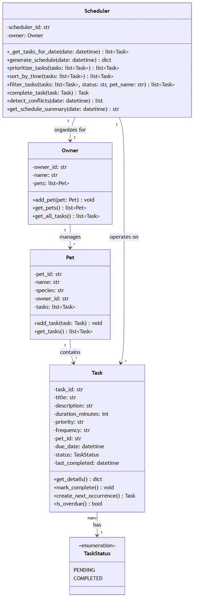

# PawPal+ (Module 2 Project)

You are building **PawPal+**, a Streamlit app that helps a pet owner plan care tasks for their pet.

## Scenario

A busy pet owner needs help staying consistent with pet care. They want an assistant that can:

- Track pet care tasks (walks, feeding, meds, enrichment, grooming, etc.)
- Consider constraints (time available, priority, owner preferences)
- Produce a daily plan and explain why it chose that plan

Your job is to design the system first (UML), then implement the logic in Python, then connect it to the Streamlit UI.

## 📐 System Design (UML)



## What you will build

Your final app should:

- Let a user enter basic owner + pet info
- Let a user add/edit tasks (duration + priority at minimum)
- Generate a daily schedule/plan based on constraints and priorities
- Display the plan clearly (and ideally explain the reasoning)
- Include tests for the most important scheduling behaviors

## Getting started

### Setup

```bash
python -m venv .venv
source .venv/bin/activate  # Windows: .venv\Scripts\activate
pip install -r requirements.txt
```

### Suggested workflow

1. Read the scenario carefully and identify requirements and edge cases.
2. Draft a UML diagram (classes, attributes, methods, relationships).
3. Convert UML into Python class stubs (no logic yet).
4. Implement scheduling logic in small increments.
5. Add tests to verify key behaviors.
6. Connect your logic to the Streamlit UI in `app.py`.
7. Refine UML so it matches what you actually built.

## 🖥️ Sample Output

Paste a sample of your app's CLI or Streamlit output here so a reader can see what a generated plan looks like:

```
# e.g.:
# Daily plan for Biscuit (Golden Retriever):
#   08:00 — Morning walk (30 min) [priority: high]
#   09:00 — Feeding (10 min) [priority: high]
#   ...

============================================================
🐾 PAWPAL+ - TODAY'S SCHEDULE
============================================================
Owner: Ryan
Date: 2026-07-05
Pets: Mochi, Dave
============================================================

📋 Total Tasks: 5
⏱️  Total Duration: 100 minutes

1. 🔴 Morning Walk
   Time: 08:00 | Duration: 30 min
   Pet: Mochi | Take Mochi for a 30-minute walk in the park

2. 🟡 Groom Mochi
   Time: 08:15 | Duration: 25 min
   Pet: Mochi | Brush Mochi's coat

3. 🟡 Afternoon Playtime
   Time: 14:30 | Duration: 20 min
   Pet: Mochi | Play fetch with Mochi in the backyard

4. 🟢 Brush Dave
   Time: 16:00 | Duration: 15 min
   Pet: Dave | Brush Dave's fur to prevent matting

5. 🔴 Feed Dave
   Time: 12:00 | Duration: 10 min
   Pet: Dave | Give Dave his lunch

============================================================
📝 Summary: Scheduled 5 task(s) for 2026-07-05. Total duration: 100 minutes. High priority: 2 task(s).
============================================================

============================================================
🕐 TASKS SORTED BY TIME
============================================================
1. Morning Walk - 08:00
2. Groom Mochi - 08:15
3. Feed Dave - 12:00
4. Afternoon Playtime - 14:30
5. Brush Dave - 16:00

============================================================
🐕 MOCHI'S TASKS
============================================================
1. Morning Walk (pending)
2. Afternoon Playtime (pending)
3. Groom Mochi (pending)

============================================================
✅ COMPLETED TASKS
============================================================
1. Feed Dave (Dave)

============================================================
🐱 DAVE'S PENDING TASKS
============================================================
1. Brush Dave

============================================================
♻️  RECURRING TASK TEST
============================================================
Before: Mochi has 3 tasks
  - Morning Walk (due: 2026-07-05 08:00)
  - Afternoon Playtime (due: 2026-07-05 14:30)
  - Groom Mochi (due: 2026-07-05 08:15)

Marking 'Morning Walk' as complete...

After: Mochi has 4 tasks
  ✅ Morning Walk (due: 2026-07-05 08:00, status: completed)
  ⏳ Afternoon Playtime (due: 2026-07-05 14:30, status: pending)
  ⏳ Groom Mochi (due: 2026-07-05 08:15, status: pending)
  ⏳ Morning Walk (due: 2026-07-06 08:00, status: pending)

✨ Next occurrence created: Morning Walk
   Task ID: task_1_next
   Due date: 2026-07-06 08:00

============================================================
🔍 CONFLICT DETECTION TEST
============================================================
Found 1 conflict(s):

  ⚠️  CONFLICT: 'Morning Walk' (08:00-08:30) overlaps with 'Groom Mochi' (08:15-08:40) for Mochi
```

## 🧪 Testing PawPal+

```bash
# Run the full test suite:
python -m pytest

# Run with coverage:
python -m pytest --cov
```
What it checks:
Empty States & Null Handling (5 tests)
✅ Empty pet with no tasks returns "No tasks scheduled"
✅ Owner with no pets returns empty task list (not crash)
✅ Filter by non-existent pet name doesn't apply filter (returns all)
✅ Filter by unknown status returns empty list
✅ Aggregate tasks across multiple pets works correctly
Sorting & Time Boundary Cases (3 tests)
✅ Tasks at exact midnight (00:00) sort correctly
✅ Two tasks at exact same time maintain stable order
✅ Unknown priority values sort last (after high/medium/low)
Conflict Detection Edge Cases (3 tests)
✅ Two tasks starting at exact same time flagged as conflict
✅ One task completely containing another detected as conflict
✅ Tasks overlapping by 1 minute detected as conflict
Recurrence & Filtering Edge Cases (5 tests)
✅ Unknown frequency (monthly, etc.) returns None safely
✅ Zero-duration recurring tasks still create next occurrence
✅ Schedule summary correctly counts 0 high-priority tasks
✅ Filter by "completed" status returns only completed tasks
✅ Filter by "pending" status returns only pending tasks

Sample test output:

```

# Paste your pytest output here

platform win32 -- Python 3.13.13, pytest-9.1.1, pluggy-1.6.0
rootdir: C:\Users\Dell User\Desktop\Codepath\ai110-module2show-pawpal-starter
plugins: anyio-4.14.1
collected 34 items                                                                                                                       

tests\test_pawpal.py ..................................                                                                            [100%]

========================================================== 34 passed in 0.55s ====

Confidence Level : ⭐⭐⭐⭐☆
```

## 📐 Smarter Scheduling

> Fill in once you've implemented scheduling logic.

| Feature | Method(s) | Notes |
|---------|-----------|-------|
| Task sorting | Scheduler.prioritize_tasks, Scheduler.sort_by_time | 1st sorts tasks by urgency: overdue tasks first, then by due date (soonest first). 2nd sorts tasks chronologically by time of day (HH:MM), which is useful for viewing schedule in strict time order. |
| Filtering | Scheduler.filter_tasks | filters tasks by completion status and/or pet name, or neither. Enables skipping completed tasks or focusing on specific pet |
| Conflict handling | Scheduler.detect_conflicts | detects overlapping time slots by calculating time windows. returns warning string |
| Recurring tasks | Scheduler.complete_task, Task.create_next_occurrence| Marks task as completed with timestamp, then calls create_next_occurrence() on the task. If it's recurring, it auto-adds the next occurrence to the pet's task list. Task.create_next_occurrence returns the next task instance (or None if not recurring) |

## 🎨 Main UI Features & Actions

### Add a Pet
- **Input fields:** Pet name (text) and species (dropdown: dog, cat, other)
- **Action:** Click "Add Pet" button
- **Result:** Pet added to your list; task count displayed (0 initially)

### Manage Tasks
**Add a task:**
- **Select a pet** from dropdown
- **Enter task details:**
  - Task title (e.g., "Morning walk")
  - Duration in minutes (1–240 min)
  - Priority level (low, medium, high)
  - Due date (calendar picker)
  - Start time (time picker)
  - Recurrence (once, daily, weekly)
- **Click "Add Task"** → task added to pet's task list

**Track task status:**
- View all tasks with visual indicators:
  - **Status icon:** ⏳ (pending) or ✅ (completed)
  - **Priority emoji:** 🔴 (high), 🟡 (medium), 🟢 (low)
- **Complete button:** Mark pending tasks as done
  - Automatically creates next occurrence for recurring tasks
- **Edit button:** Modify task details (title, duration, priority, time, recurrence)

### Build & View Schedule
**Generate schedule with filters:**
- **Filter by Pet:** View tasks for all pets or a specific pet
- **Filter by Status:** Show all, pending, or completed tasks
- **Filter by Priority:** Show all, high, medium, or low priority
- **Sort by:** 
  - "Priority + Time" (overdue/urgent tasks first, then chronological)
  - "Time Only" (strict chronological order by time of day)

**Schedule displays:**
- **Metrics:** Total tasks, total duration, pending count, completed count
- **Task table** with:
  - Task number (#)
  - Status icon (✅/⏳)
  - Priority emoji (🔴/🟡/🟢)
  - Task title and pet name
  - Start time (HH:MM format)
  - Duration in minutes
  - Recurrence type

---

## 📋 Example Workflow

### Step 1: Add a Pet
```
1. Enter pet name: "Mochi"
2. Select species: "dog"
3. Click "Add Pet" → "✓ Added Mochi the dog!"
```

### Step 2: Add Tasks for Mochi
```
Task 1: Morning Walk
  - Duration: 30 min
  - Priority: high
  - Time: 08:00
  - Recurrence: daily
  
Task 2: Afternoon Playtime
  - Duration: 20 min
  - Priority: medium
  - Time: 14:30
  - Recurrence: daily

Task 3: Groom Mochi
  - Duration: 25 min
  - Priority: medium
  - Time: 08:15
  - Recurrence: weekly
```

### Step 3: View Today's Schedule
```
Filters: None | Sort: Priority + Time

📊 Considering 3 task(s)
- Total Tasks: 3
- Total Duration: 75 minutes
- Pending: 3

Schedule (sorted by urgency + time):
  1. 🔴 Morning Walk (Mochi) - 08:00 | 30 min
  2. 🟡 Groom Mochi (Mochi) - 08:15 | 25 min
  3. 🟡 Afternoon Playtime (Mochi) - 14:30 | 20 min

⚠️ CONFLICT DETECTED:
  'Morning Walk' (08:00-08:30) overlaps with 
  'Groom Mochi' (08:15-08:40) for Mochi
```

### Step 4: Complete a Task & Trigger Recurrence
```
Click "✓ Complete" on Morning Walk
  → Task marked complete
  → Next occurrence auto-created: Morning Walk (tomorrow 08:00)
  → Mochi now has 4 tasks (including tomorrow's walk)
```

### Step 5: Filter & Refine
```
Filter by Status: "pending"
Sort by: "Time Only"

Result: Show only uncompleted tasks in strict time order:
  1. Groom Mochi - 08:15
  2. Afternoon Playtime - 14:30
  3. Morning Walk (tomorrow) - 08:00 ← from daily recurrence
```

---

## 🔑 Key Scheduler Behaviors Demonstrated

### 1. **Sorting by Priority + Urgency**
- **Overdue tasks appear first** (regardless of priority level)
- **Then pending tasks sorted by:** high → medium → low priority
- **Within same priority:** sorted by due date (soonest first)

Example:
```
⏳ Overdue low-priority task    (overdue beats everything)
🔴 High-priority pending task   (urgency next)
🟡 Medium-priority pending task
🟢 Low-priority pending task
```

### 2. **Sorting by Time Only**
- Tasks arranged in strict chronological order by start time (HH:MM)
- 00:00 (midnight) → 23:59 (11:59 PM)
- Useful for viewing the schedule as a timeline

### 3. **Conflict Detection & Warnings**
The system detects when tasks **overlap in time for the same pet**:
- **Flags:** "Task A (08:00-08:30) overlaps with Task B (08:15-08:40) for Mochi"
- **Not flagged:** 
  - Adjacent tasks (ends at 9:30, next starts at 9:30) 
  - Same time for different pets 
  - Different dates 

### 4. **Recurring Task Management**
- **Daily tasks:** Auto-create next occurrence at same time tomorrow
- **Weekly tasks:** Auto-create for 7 days later
- **One-time tasks:** No recurrence, marked complete and stays done
- **Auto-add:** New occurrence automatically added to pet's task list

Example state change:
```
Before complete:
  Mochi (3 tasks):
    - Morning Walk (today, 08:00) - pending
    - Afternoon Playtime (today, 14:30) - pending
    - Groom Mochi (today, 08:15) - pending

After marking "Morning Walk" complete:
  Mochi (4 tasks):
    ✅ Morning Walk (today, 08:00) - COMPLETED
    ⏳ Afternoon Playtime (today, 14:30) - pending
    ⏳ Groom Mochi (today, 08:15) - pending
    ⏳ Morning Walk (tomorrow, 08:00) - pending ← NEW
```

### 5. **Flexible Filtering**
Combine filters to answer questions like:
- "What high-priority pending tasks do I have for Mochi?"
- "Show me all completed tasks"
- "What's left to do for both pets today?"

---

## 📸 Demo Walkthrough

Describe your app in numbered steps so a reader can follow along without watching a video:

1. **Add a pet** with name and species
2. **Add tasks** with duration, priority, time, and recurrence type
3. **Review the task list** with status (✅/⏳), priority, and pet
4. **Generate a schedule** and apply filters (pet, status, priority)
5. **Choose sort order** (Priority + Time for smart scheduling, Time Only for timeline view)
6. **View conflicts** — system warns if two tasks overlap for the same pet
7. **Complete a task** — if it's recurring (daily/weekly), next occurrence auto-creates
8. **Edit tasks** anytime to adjust duration, priority, or recurrence

**Screenshot or video** *(optional)*: <!-- Insert a screenshot or link to a demo video here -->
